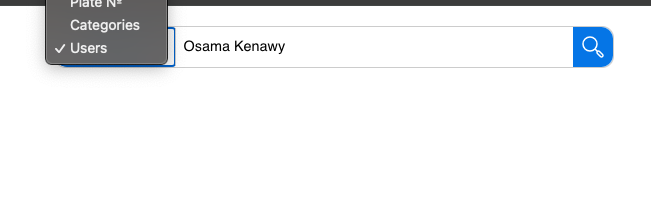

# Search Component with Filter Types

A customizable Vue 3 search component that combines a search bar with a filter type dropdown and an icon button. The component allows users to select a search type and enter a search query, which is emitted as an object to the parent component.




## Features

- Customizable search types through props
- Emits both `searchQuery` and `searchType` as an object to the parent component
- Closes the search bar automatically after submission
- Supports both initial and dynamic updates of search queries

## Project Setup
- npm install
- npm run dev

### 1. Clone the Repository

```bash
git clone https://github.com/osamahkenawy/filter-search-bar.git
cd filter-search-bar
